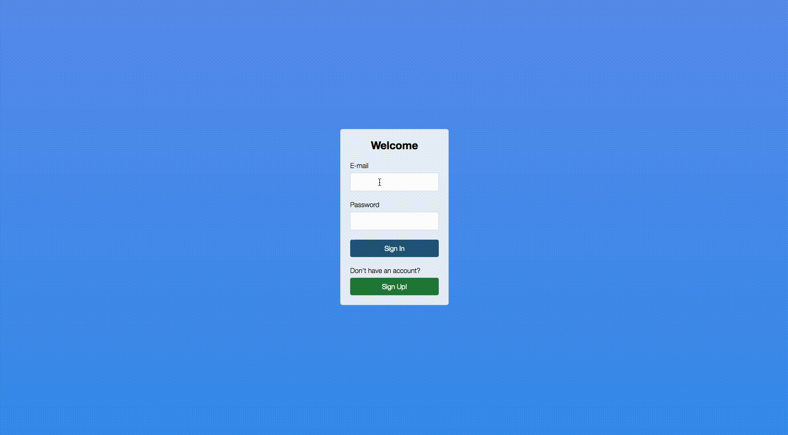

  

  
  
  

Node.js is a **JavaScript runtime** built on Chrome's V8 JavaScript engine. Node.js
uses an **event-driven, non-blocking I/O model** that makes it lightweight and
efficient. The Node.js package ecosystem, **npm**, is the largest ecosystem of
open source libraries in the world.

# Introduction

This is a NodeJs related projects repo, it is a real time chat application based on websocket. Below is the demo:

# Note:
This app is deployed on Heroku. Here is the [LINK](https://chatappkevin.herokuapp.com/) if you are interested. 

